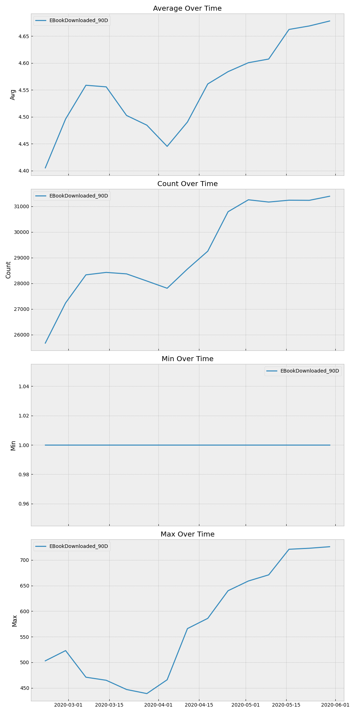

# Churn Analysis

## Business Problem
Our task is to analyze customer behavior on Manning’s liveBook website to understand the factors that influence customer retention and churn. The goal is to determine what encourages customers to return to the website regularly and identify the reasons why some customers stop visiting. By gaining insights into these patterns, we aim to develop strategies to enhance customer engagement and reduce churn, ultimately improving the overall customer experience and business performance.

### Project breakdown:
1. Clean and process customer behavior data for churn analysis.
2. Analyze customer metrics to uncover patterns and behavior that indicate customer churn.
3. Developed machine learning models to predict customer churn.

## Data
The raw data consists of event records dumped into a CSV file.

| account_id                          | event_time              | event_type                      | product_id | additional_data                                         |
|-------------------------------------|-------------------------|---------------------------------|------------|---------------------------------------------------------|
| 608aa5969cef2edc29cb0c46deaec9da    | 2019-11-29 12:10:08.154 | DashboardLivebookLinkOpened     | 1156       | /book/learn-dbatools-in-a-month-of-lunches              |
| d07263602248aa70ce1967d6f98f9506    | 2019-11-29 12:10:19.962 | ReadingOwnedBook                | 610        | 60s                                                     |
| b7d5902d66127909d0f9d766a841ebb5    | 2019-11-29 12:11:20.707 | ReadingOwnedBook                | 1172       | 480s                                                    |
| d07263602248aa70ce1967d6f98f9506    | 2019-11-29 12:11:41.283 | ProductTocLivebookLinkOpened    | 1066       | /book/grokking-machine-learning/chapter-1               |
| 89f7601cb558e1c47b00a7fabb6a466c    | 2019-11-29 12:11:58.253 | ReadingOwnedBook                | 1073       | 960s                                                    |

## Data processing

#### Snapshot of most popular events
| event_type            | n_event | n_account | events_per_account | n_months | events_per_account_per_month |
|-----------------------|---------|-----------|---------------------|----------|------------------------------|
| ReadingOwnedBook      | 748,260 | 89,467    | 8.364               | 6.679    | 1.252                        |
| FirstLivebookAccess   | 658,226 | 89,467    | 7.357               | 6.679    | 1.102                        |
| FirstManningAccess    | 657,340 | 89,467    | 7.347               | 6.679    | 1.100                        |
| EBookDownloaded       | 277,356 | 89,467    | 3.100               | 6.679    | 0.464                        |
| ReadingFreePreview    | 138,197 | 89,467    | 1.545               | 6.679    | 0.231                        |

Created metric tables and calculated summary metrics for customers.

#### Example of an event over time.

FirstLiveBookAccess and FirstManningAccess only start appearing in Feb 2020 unlike other events that start in Dec 2019

### Learning about the data.
> Metrics are summarized events at points in time (a.k.a. features)
#### Count of events over time.
- We us counts as our primary feature.-
- aggregated event counts with a 90 day look nack period. Date ranges were selected based on EDA that showed cylical pattern where people are reading Manning books on the weekdays. Measurements times to pickup a full week each period. 

- FirstLiveBookAccess and FirstManningAccess have only one user for all activity. Seems like a QA issue.

### Typical customer activity profile.
| metric_name                      | count_with_metric | n_account | pct_with_metric | avg_value | min_value | max_value | earliest_metric     | latest_metric       |
|----------------------------------|-------------------|-----------|-----------------|-----------|-----------|-----------|---------------------|---------------------|
| EBookDownloaded_90D              | 47,920            | 64,622    | 74.15%          | 4.56      | 1         | 726       | 2020-02-22 00:00:00 | 2020-05-30 00:00:00 |
| LivebookLogin_90D                | 33,508            | 64,622    | 51.85%          | 1.62      | 1         | 175       | 2020-02-22 00:00:00 | 2020-05-30 00:00:00 |
| ReadingOwnedBook_90D             | 27,130            | 64,622    | 41.98%          | 21.83     | 1         | 1,585     | 2020-02-22 00:00:00 | 2020-05-30 00:00:00 |
| FreeContentCheckout_90D          | 21,956            | 64,622    | 33.98%          | 4.41      | 1         | 49,792    | 2020-02-22 00:00:00 | 2020-05-30 00:00:00 |
| ReadingFreePreview_90D           | 21,591            | 64,622    | 33.41%          | 5.78      | 1         | 365       | 2020-02-22 00:00:00 | 2020-05-30 00:00:00 |
| ProductTocLivebookLinkOpened_90D | 17,569            | 64,622    | 27.19%          | 4.11      | 1         | 16,905    | 2020-02-22 00:00:00 | 2020-05-30 00:00:00 |
| ReadingOpenChapter_90D           | 15,445            | 64,622    | 23.90%          | 5.76      | 1         | 386       | 2020-02-22 00:00:00 | 2020-05-30 00:00:00 |
| DashboardLivebookLinkOpened_90D  | 10,990            | 64,622    | 17.01%          | 3.71      | 1         | 1,065     | 2020-02-22 00:00:00 | 2020-05-30 00:00:00 |
| WishlistItemAdded_90D            | 8,356             | 64,622    | 12.93%          | 3.76      | 1         | 448       | 2020-02-22 00:00:00 | 2020-05-30 00:00:00 |
| CrossReferenceTermOpened_90D     | 7,162             | 64,622    | 11.08%          | 3.77      | 1         | 873       | 2020-02-22 00:00:00 | 2020-05-30 00:00:00 |
| HighlightCreated_90D             | 3,022             | 64,622    | 4.68%           | 33.72     | 1         | 1,453     | 2020-02-22 00:00:00 | 2020-05-30 00:00:00 |
| FirstManningAccess_90D           | 1                 | 64,622    | 0.00%           | 320,472.33| 19,534    | 624,306   | 2020-03-14 00:00:00 | 2020-05-30 00:00:00 |
| FirstLivebookAccess_90D          | 1                 | 64,622    | 0.00%           | 320,588.08| 19,389    | 625,186   | 2020-03-14 00:00:00 | 2020-05-30 00:00:00 |

### Metric Statistics QA:

- More than 25,000 users have downloaded an ebook.
- Average downloads per user are between 4 and 5.
- The maximum number of downloads per user range from 450 to over 700 downloads.

Note these could be one account with multiple users like a corporate account.